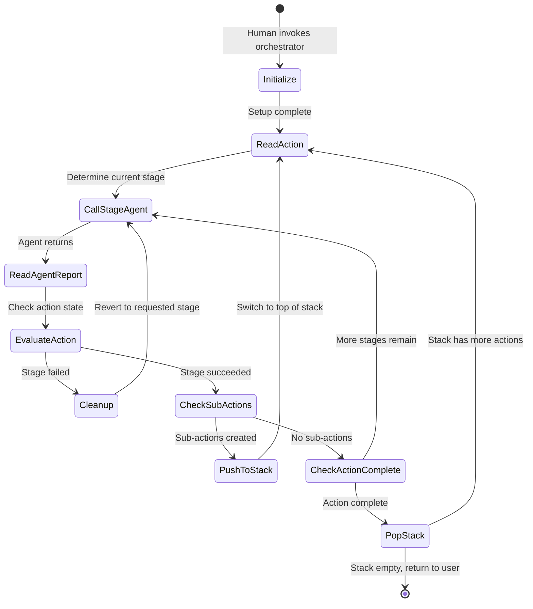

# Notes
- LLMs can only think while writing. So they should have some space to create markdown documents to reason with while working through action. Some clients have this built in to their thinking models. But it might be best to make it explicit.
- the recursive nature of action might balloon the context for agents depending on the scope of the problem. Best to make a flat system
- Bot-thoughts-<stage>.md and memory-action.md documents to pass between stages and actions as scratch pads?
- Probably will want to pass through the original prompt as well, or atleast track it in a file
- Separate agent per stage? or break down even further

- Might need to define more about how the agent will "determine next stage to run"
- LLM had a little trouble generating the mermaid diagram the first time around. it made a single node for "run agent" I think it was more it's mistake then my own

# Statement of Action
Create an agent workflow that will follow the action lite process

# Statement of Inputs
- [Create action-lite protocol](Create%20action-lite%20protocol.md)
- [Create development philosophy claude file skill and development tool context](Create%20development%20philosophy%20claude%20file%20skill%20and%20development%20tool%20context.md)

# Statement of Specifications
- [ ] Orchestration limited to the scope of a single action and its sub-actions.
- [ ] Must utilize flat recursion 
- [ ] Orchestration agent must be able to be used as a "main agent" but should not rely on "CLAUDE.md" file to do so
- [ ] Must include action lite agent skill
- [ ] Agents and skills must be packaged as a claude plugin

# Statement of Design
Each stage in the action lite workflow will get its own dedicated agent.
- Discovery
- Design
- Implementation
- Test
- Documentation
- Publish

Each agent will have a narrowly defined goal in accordance with the action lite workflow. This goal should be 1 to 2 paragraphs at the most.

A main "orchestration agent" will be defined that will control the process at a high level and will call sub-agents and prompt and create necessary files. The agent should be limited to only completing a single action and its sub-actions at a time.

Agent artifacts will be used to pass information between stages. This will get its own directory in the project labeled "agent artifacts". These documents are for agent reasoning only. Each action item given to the LLM will have its own sub-directory in the artifact directory. It will contain the documents produced and associated with the action throughout the entire workflow.

Due to the nature of LLMs they can only "reason" while generating resources. All long context reasoning happens by looping over outputs and writing new information about those outputs. LLM reasoning can only happen in language.

```
agent-artifacts/
  action-stack.md
  action-item/
    bot-thoughts-{stage}.md
    original-prompt.md
    memory.md
```

Each action artifact directory should contain the following items
- bot-thoughts-{stage}.md
- original-prompt.md
- memory.md

# bot thoughts
Each per stage agent will be given a "bot-thoughts.md" document to reason in as a scratch pad. This should be used in conjunction with their built in reasoning systems. No information in this document should be thought of as concrete and more like surface level thoughts, bad and good ideas are welcome here. These documents are only shared with the stage they belong to.

# Original prompt
Passing the original prompt through to each agent stage will help keep the process aligned through all stages. Additionally agents are of course given access to the action documents themselves which contain task requests and design information. I've observed this pseudo attention mechanism provides higher quality reasoning outputs.

# Memory.md
Memory.md is a document which is passed between stages. It contains long term information the LLM believes may be important for other agents to see, but does not belong in the action document itself. Think of it as the agent's long term memory. It also takes advantage of the pseudo attention mechanism.

# action stack.md
is a first in last out stack of actions. Each line represents a single action and should contain the file name of the action. The item on the top of the stack is the current active action. 

# The workflow
The main agent should be callable only by humans and will orchestrate the sub-agents as so.

## Initalize the agent
- provide the orchestration agent with context and activate the agent lite skill
- Orchestration agent ensures action stack is empty. if not it is emptied and the current action is added as the first element
- Orchestration Agent ensures "agent-artifacts" directory exists and that an action item sub directory is present for the action. Stores the original prompt and creates a memory document
- Orchestration Agent reads the action item to check what stage it is in.
- Orchestration Agent begins the workflow in the appropriate phase based on the current state of the document.

## The workflow
The orchestration agent, based on the current state of the action, should call the most appropriate sub agent.

The orchestration agent will pass it the paths of the following files
- bot-thoughts-{stage}.md (create if not present)
- memory.md
- original-prompt.md
- the path to the current action document.

Each stage agent should return a single sentence stating if it failed or completed successfully. If it failed the sub agent should return the name of the stage we should return to.

After completion the orchestration agent will check the current state of the action document and the previous agents report statement to determine what do next.

if the action item failed the orchestrator will clean up after it, then call then revert to the requested stage.

If the action ends up having sub-actions, the orchestrator will wait for the implementation agent to create the first set of sub-actions and their statements of actions, then will add them all to the action stack. Orchestration agent should then switch to orchestrating for the action on the top of the stack.

If the action is complete the agent will check the action stack document, update it if needed, and move on to the next action in the stack. If empty it will return control back to the user.



